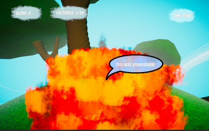

# LudumDare 50 That's Life

This little Game was made for the LudumDare50 Compo Event.
This means that this Game was made in 48 hours and that all Art and Code and Sound was self made. This means also that this Game was made for fun. It is not polished and the source code is also not written in a beauty way.
 
 
If you want to play it, you can find it under the following links:

- [LudumDare Site](https://ldjam.com/events/ludum-dare/50/thatslife)  
- [Itch.io Site](https://maxi1324.itch.io/thats-life)

 
The Results are unfortunately not very good. There was a Bug with the LudumDare Site.
After I had 20 Votes, no one could vote. I still had much fun creating this Game, so it's okay.

# Description

In this Game you play as a Car. Your Car is driving around a little Planet.

On your Planet are Factories. These Factories pump Co2 into the atmosphere. You decide to save your planet. You decide to destroy them by driving into them. 

But you have to be careful, if you are to slow the time runs out and the Air is to much polluted.

You can pickup Speedorbs, which make you faster and you can drift. 
The drifting works like the drifting in Mario Kart.

If you crash into something else you loose. 
If you destroy a Factory you get points and if you get them fast, you get more points.

At the end you get a Score
 

## Known Bugs:

There are two mayor bugs.
- At the Poles of the Planet you are dragged to them. Unfortunately there is a tree. So the game forces you to dive into the tree. You are a able to compensate, but it's still annoying. 

- The Explosion particles are to big. They compromise your view.

